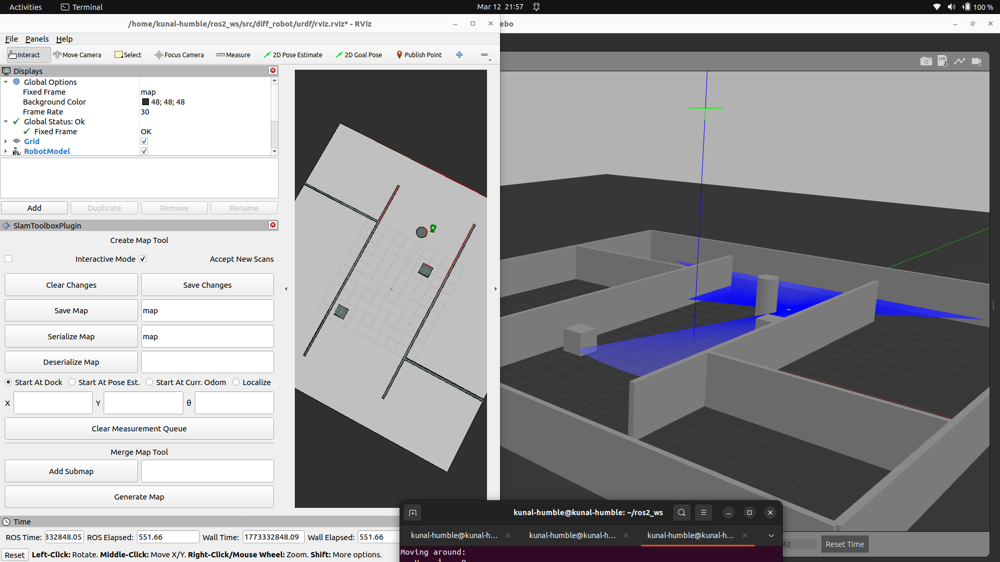
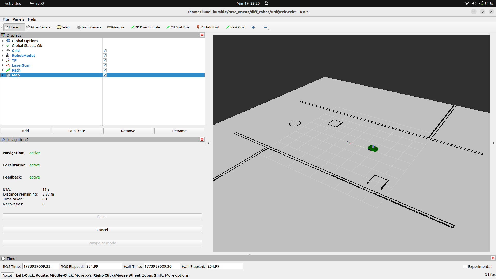
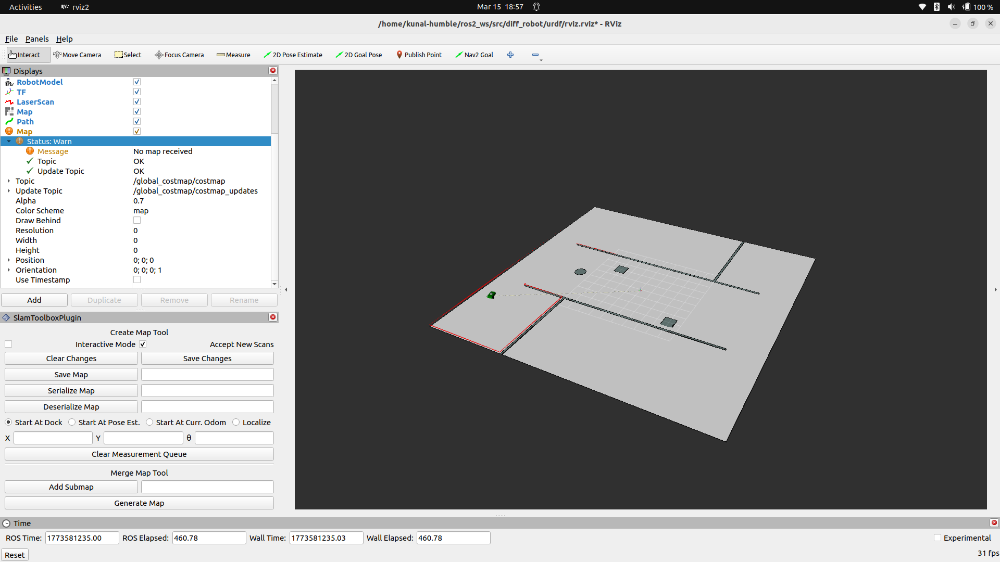
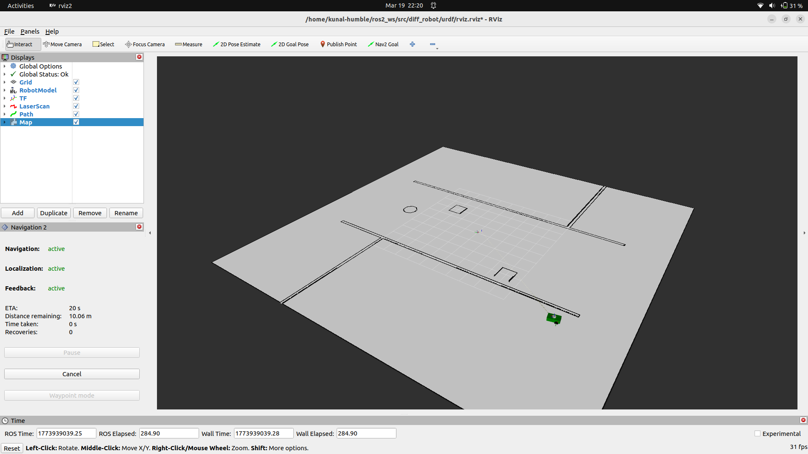
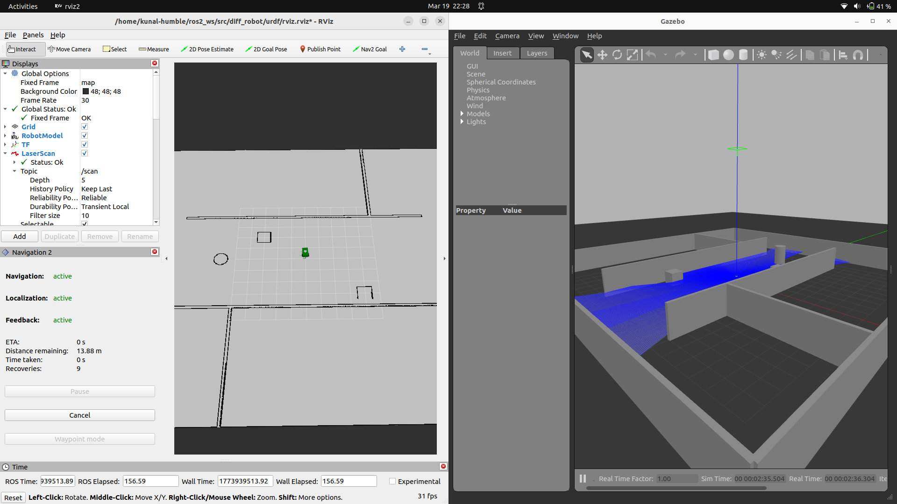
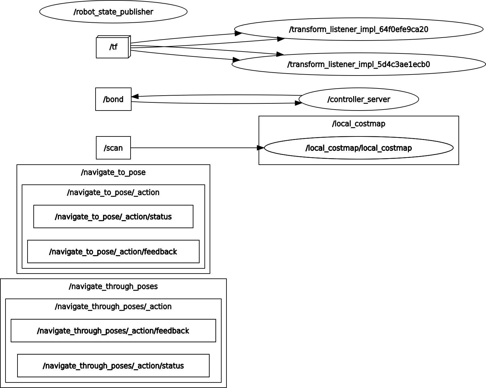
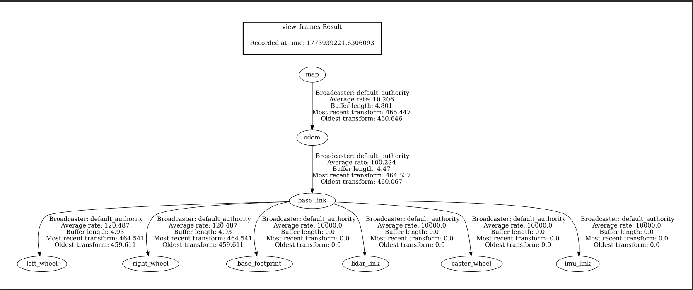

<p align="center">
  
</p>

<p align="center">
  
  
  
  
  
</p>

<h1 align="center">🚗 ROS 2 Autonomous Navigation Robot</h1>

<p align="center">
A <b>fully autonomous mobile robot</b> built using <b>ROS 2 Humble</b>, <b>Gazebo</b>, and <b>Nav2</b>, capable of <b>mapping, localization, and goal-based navigation</b> in a custom simulation environment.
</p>

---

## 🎥 Demo

<p align="center">
  
</p>

---

## 🖼️ Project Showcase

<p align="center">
  
  
</p>

<p align="center">
  
  
</p>

---

## 🧠 What This Project Demonstrates

This project showcases:

- ✅ Full **robotics pipeline (Perception → Localization → Planning → Control)**
- ✅ Strong understanding of **ROS 2 architecture**
- ✅ Hands-on experience with **Nav2 stack**
- ✅ Debugging of real-world issues:
  - TF tree errors
  - Costmap tuning
  - QoS mismatches
- ✅ Ability to design **scalable, modular systems**

---

## ⚙️ System Architecture

### 🔹 High-Level Flow
```
LiDAR → SLAM → Map → AMCL → Nav2 Planner → Controller → cmd_vel → Robot
```


---

### 🔹 ROS 2 Graph (rqt_graph)

<p align="center">
  
</p>

---

### 🔹 TF Tree

<p align="center">
  
</p>

---

## 🚗 Robot Capabilities

- 🗺️ **Mapping using SLAM Toolbox**
- 📍 **Localization using AMCL**
- 🎯 **Goal-based navigation (Nav2)**
- 🚧 **Obstacle avoidance (costmaps)**
- 📡 **LiDAR-based perception**
- 🔁 **Stable TF tree (`map → odom → base_link`)**
- 🕹️ **Manual + autonomous control**

---

## 🧩 Navigation Stack Breakdown

| Component | Role |
|----------|------|
| Map Server | Loads static map |
| AMCL | Localization |
| Planner Server | Global path planning |
| Controller Server | Local trajectory execution |
| BT Navigator | Decision making |

---

## 🧪 Simulation Environment

- Gazebo Classic  
- Custom maze world  
- Differential drive robot  
- Realistic LiDAR + IMU sensors  

---

# 🐳 Docker Deployment

##  Build Image

```bash
cd ~/ros2_ws/src/diff_robot
docker build -t diff_robot_nav2 .
```

##   Run Container 

```bash
xhost +local:docker

docker run -it \
--env="DISPLAY" \
--env="QT_X11_NO_MITSHM=1" \
--env="LIBGL_ALWAYS_SOFTWARE=1" \
--volume="/tmp/.X11-unix:/tmp/.X11-unix:rw" \
--net=host \
--name diff_robot_container \
diff_robot_nav2
```

## Run Simulation
```bash
source /ros2_ws/install/setup.bash
ros2 launch diff_robot robot.launch.py
```

## Run Navigation (New Terminal)
```bash
docker exec -it diff_robot_container bash
```
```bash
source /ros2_ws/install/setup.bash
ros2 launch diff_robot nav2.launch.py
```

# Usage
1. Open RViz
2. Set Initial Pose
3. Send Navigation Goal
4. Robot autonomously reaches target 
